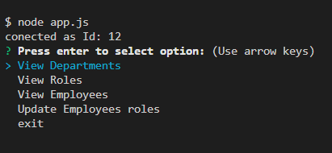
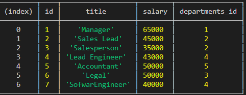
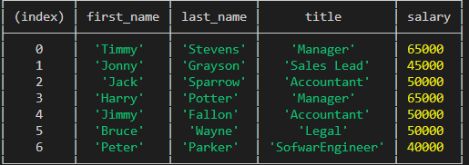
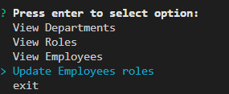
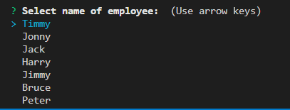
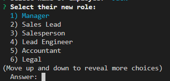

# Express: Employee tracker

## Table of Contents

* [Description](#description)
* [Links](#links)
* [Screenshots](#screenshots)
* [Installation](#installation)
* [Usage](#usage)
* [Technologies Used](#technologies)
* [Questions](#questions)

## Description

A node application that which will allow you to show all the employees, their department roles and other informatiuon. Also alow the user to be able to change the information about the employee from the database using the comand terminal. 

## Links

[View a Video Demonstration](https://drive.google.com/file/d/1EU3wkwNWJLQo2z9xjMsXZQw6n32240og/view)

## Screenshots

## Installation Instructions

* run "npm run install" in bash terminal to get package-lock.json and node_modules
* run "node app.js"

## Usage

in the command line, run "node app.js". you will be prompted on what you would like to do with the employee directory. use the up and down arrow keys to toggle the chocies and enter the select the desired choice. 
 

## Technologies Used

node, express, inquirer, mysql

## Questions

If you have further projects and questions, you can find me on Github: [GITHUB](https://github.com/benimahat1291). 
please visit my portfolio to find contact information: [BENI MAHAT](https://benimahat1291.github.io/Portfolio_v2/#/). 

